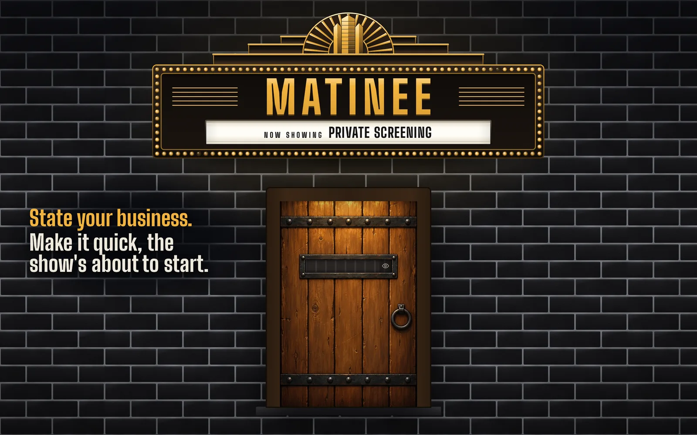
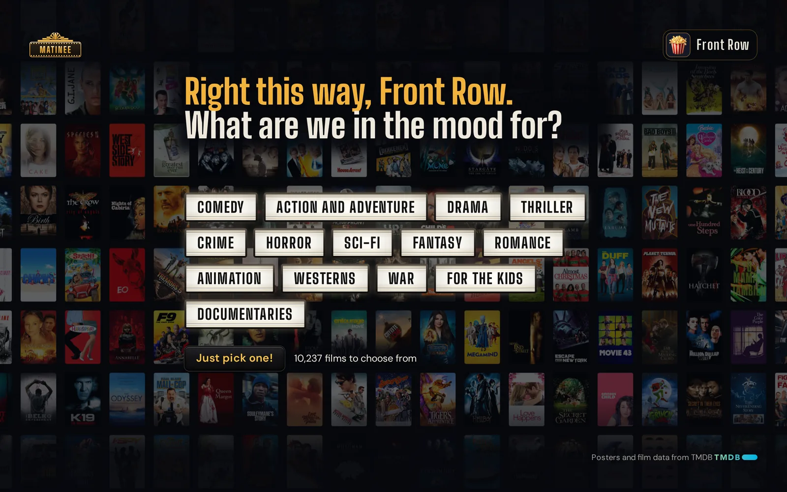

# Matinee


**Name the mood. We'll find the picture.**

[Try the interactive demo](https://ivegonetoplaid.github.io/) · [Get started](docs/getting-started.md) · [Contribute](CONTRIBUTING.md)

Sometimes you ask for horror and get *Hubie Halloween* when what you wanted was *Hellraiser*. A genre label doesn't know what kind of night you're having.

Matinee asks a few questions about the mood, then picks **one film** and presents it as tonight's showing. Not that one? Ask for another. No endless poster grid, and no AI subscription required.



*Set a door word and Matinee waits behind this. Friends type it once at the slot; bots and passers-by stay on the pavement.*

## What's playing?

- **A conversation, not a search box.** Choose a mood, follow a short question tree, or hit **Just pick one!**
- **A door, not a login.** An optional door word keeps strangers and bots out. Each device knocks once and is remembered for 400 days. No accounts and no passwords to reset.
- **At home on a phone.** Add Matinee to the home screen on iPhone or Android and it opens full-screen, like an app. Every screen is laid out for phones as carefully as for a desktop.
- **Films that fit the answer.** An opinionated sort of roughly 10,300 films, with MovieLens tag-genome scores to help distinguish things like how gory a horror film is.
- **Your collection, if you want.** Read from **Jellyfin or Plex**, or use Matinee without a media server. With a library, choose films you own, films you don't, or both. Matinee never changes your library.
- **A little more help.** Optional **Seerr** links for requests and **DoesTheDogDie** checks for topics you'd rather avoid. Content checks are best-effort, not guarantees.
- **Your own taste wins.** Keep local classification overrides without losing them on updates. Viewers have local profiles; there's no Matinee cloud account.

Matinee picks a film; it doesn't play one. That's still your media server's job.

## Take a seat



**[Try Matinee in your browser →](https://ivegonetoplaid.github.io/)**

The demo shows the real interface, artwork and dialogue with a small, scripted set of films. It runs entirely in the browser: no install, account or access to your media library. Some settings and external-link controls are display-only in the demo.

## Run it at home

You'll need **Docker** (or Python 3.12+), a free **TMDB API Read Access Token**, and somewhere to keep Matinee's data. Everything else is optional.

It doesn't need much. I use Matinee every day on my own home server, and it's also been checked on a **Raspberry Pi 5 with 2 GB of memory**: with its full table of over 10,000 films and a 4,000-film Jellyfin library, the site and its nightly rebuild together peaked at about 350 MB.

```sh
mkdir matinee && cd matinee
curl -fsSLO https://raw.githubusercontent.com/ivegonetoplaid/matinee/main/compose.yaml
curl -fsSL https://raw.githubusercontent.com/ivegonetoplaid/matinee/main/example.env -o .env
```

Set `TMDB_TOKEN` in `.env`, then:

```sh
mkdir -p state && sudo chown 1000:1000 state
docker compose up -d
```

Open `http://<your-server>:8000`. The film table fills in as the first rebuild runs. To update later, run `docker compose pull && docker compose up -d`.

Matinee is in **beta**. Releases are numbered 0.x: an update that changes only the last number (0.1.3 to 0.1.4) is always safe, and one that changes the middle number (0.1 to 0.2) may need steps, which its [release notes](https://github.com/ivegonetoplaid/matinee/releases) give.

**[Read the full getting-started guide →](docs/getting-started.md)** for the token, optional integrations, HTTPS setup, first-run behaviour, troubleshooting, data backups and non-Docker installation.

## Behind the curtain

- [Getting started and day-to-day operation](docs/getting-started.md)
- [Suggest a better film classification](CONTRIBUTING.md#where-films-belong) · [Report an issue](https://github.com/ivegonetoplaid/matinee/issues)
- [Contributing](CONTRIBUTING.md) · [Agent instructions](AGENTS.md)
- [The behaviour specification](docs/spec/matinee.md) · [Coding standards](CODING_STANDARDS.md) · [Design standards](DESIGN_STANDARDS.md)

Development starts with `./bootstrap.sh`; `./check.sh` runs the project's checks.

## Licence and acknowledgements

Matinee's source is **AGPL-3.0-or-later** (see [LICENSE](LICENSE)). Third-party assets and data have their **own** terms: in particular, the bundled MovieLens-derived files are limited to research and non-commercial use, and TMDB and DoesTheDogDie have additional usage restrictions. See [data, terms and credits](docs/getting-started.md#data-terms-and-credits) before redistributing or using Matinee commercially.

This product uses the TMDB API but is not endorsed or certified by TMDB. Content warnings are Powered by [DoesTheDogDie.com](https://www.doesthedogdie.com).

MovieLens tag-genome data is credited to:

- F. Maxwell Harper and Joseph A. Konstan. 2015. *The MovieLens Datasets: History and Context.* ACM Transactions on Interactive Intelligent Systems 5, 4: 19:1–19:19. https://doi.org/10.1145/2827872
- Jesse Vig, Shilad Sen and John Riedl. 2012. *The Tag Genome: Encoding Community Knowledge to Support Novel Interaction.* ACM Transactions on Interactive Intelligent Systems 2, 3.